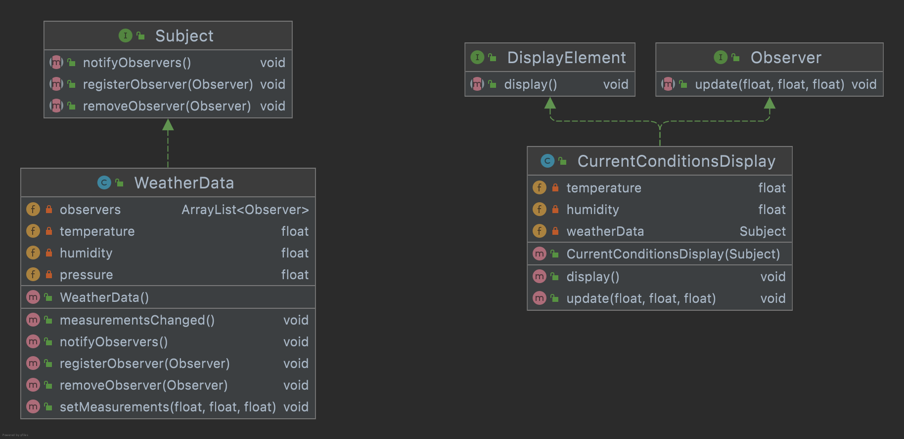
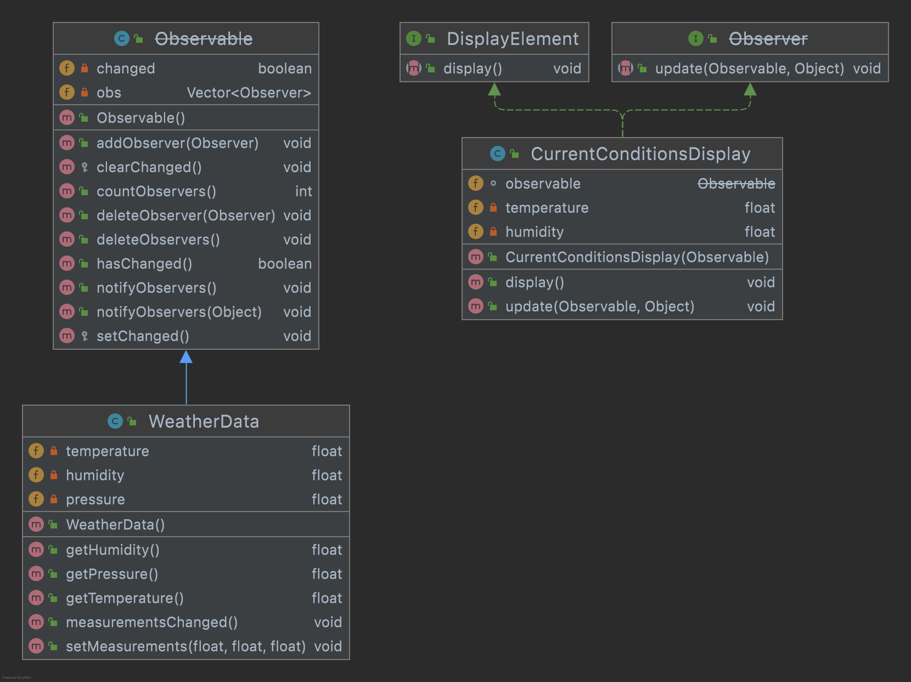

# 옵저버 패턴

## 정의
옵저버 패턴(Observer Pattern)에서는 한 객체의 상태가 바뀌면 그 객체에 의존하는 다른 객체들한테 연락이 가고 자동으로 내용이 갱신되는 방식으로 일대다
(ont-to-many)의존성을 정의한다.  
예) 신문사와 정기구독자로 이루어지는 신문 구독 서비스에 비유할 수 있다.

일대다 관계는 **주제** 와 **옵저버** 에 의해 정의된다. 옵저버는 주제에 의존한다.  
주제의 상태가 바뀌면 옵저버한테 연락이간다.  

옵저버 패턴을 구현하는 방법에는 여러 가지가 있지만, 대부분 주제(Subject) 인터페이스와 옵저버(Observer)인터페이스가 들어있는 클래스 디자인을 바탕으로 한다.

## 자바 내장 옵저버 패턴
자바에서 몇 가지 API를 통해 자체적으로 옵저버 패턴을 지원하기도 한다.  
가장 일반적으로 쓸 수 있는 것으로 java.util 패키지에 들어있는 Observer 인터페이스와 Observable 클래스를 들 수 있다.  
이 두 클래스는 이전에 구현했던 Subject와 Observer 인터페이스와 꽤 비슷하지만, 더 많은 기능을 제공한다.  
**푸시 방식** 으로 갱신할 수도 있고, **풀 방식** 으로 갱신할 수도 있다.

### java.util.Observable의 단점
- Observable은 클래스이다.
  - Observable이 클래스기 때문에 서브 클래스를 만들어야 한다는 점이 문제가 된다. 이미 다른 수퍼클래스를 확장하고 있는 클래스에 Observable의 기능을 
    추가할 수 없다. 그래서 **재사용성**에 제약이 생기게 된다.
  - Observable 인터페이스라는 것이 없기 때문에 자바에 내장된 Observer API하고 잘 맞는 클래스를 직접 구현하는 것이 불가능하다. java.util 
    구현을 다른 구현으로 바꾸는 것도 불가능하다. (예를 들어 멀티스레드로 구현한다거나 하는 일은 아예 불가하다.)

- Observable 클래스의 핵심 메소드를 외부에서 호출할 수 없다.
  - Observable API를 살펴보면, setChanged() 메소드가 protected로 선언되어 있다. Observable의 서브 클래스에서만 setChanged
  ()를 호출할 수 있다. 직접 어떤 클래스를 만들고, Observable의 서브 클래스를 인스턴스 변수로 사용하는 방법도 쓸 수 없다. 이런 디자인은 상속보다는 구성을 
   사용한다는 디자인 원칙에도 위배된다.

### 그럼 무엇을 써야 하는지(java.util.Observable과 직접 구현한 Observer 패턴)?
둘 중 어떤 방법을 쓰든 옵저버 패턴만 제대로 알고 있다면 그 패턴을 활용하는 API는 어떤 것이든 잘 활용할 수 있기에 상관 없다.

### java9 버전 부터 deprecated
https://docs.oracle.com/javase/9/docs/api/java/util/Observable.html    
java 9 버전부터 Observable과 Observer가 decprecated 되었다.  
잘은 모르지만 해당 API가 지원하는 이벤트 모델이 매우 제한적이며 알림의 순서가 지정되지 않고 일대일로 대응하지 않는다고 하는 것 같다.  
그렇기에 직접 패턴을 구현하는 것이 좋을 것 같다.
~~~
Deprecated. 
This class and the Observer interface have been deprecated. 
The event model supported by Observer and Observable is quite limited, the order of notifications delivered by Observable is unspecified, and state changes are not in one-for-one correspondence with notifications. 
For a richer event model, consider using the java.beans package. 
For reliable and ordered messaging among threads, consider using one of the concurrent data structures in the java.util.concurrent package. 
For reactive streams style programming, see the Flow API.
~~~

## 핵심 정리

- 옵저버 패턴에서는 객체들 사이에 일대다 관계를 정의한다.
- 주제, 또는 Observable 객체는 동일한 인터페이스를 써서 옵저버에 연락을 한다.
- Observable에서는 옵저버들이 Obvserver 인터페이스를 구현한다는 것을 제외하면 옵저버에 대해 전혀 모르기 때문에, 이들 사이의 결합은 느슨한 결합이다.
- 옵저버 패턴을 이용하면 주제 객체에서데이털르 보내거나 (푸시 방식) 옵저버가 데이터를 가져오는 (풀 방식)을 쓸 수 있다.(풀 방식이 더 **옳은** 것으로 간주한다.)
- 옵저버들한테 연락을 돌리는 순서에 절대로 의존하면 안된다.
- 자바에는 범용으로 쓸 수 있는 java.util.Observable을 비롯하여 옵저버 패턴을 구현한 것들이 여럿 있다.
- java.util.Observable의 몇 가지 문제점에 주의해야 한다.
- 필요하면 언제든지 주저하지 말고 Observable 클래스에 상용하는 클래스를 직접 구현해야 한다.
- 스윙 및 여러 GUI 프레임워크에서 옵저버 패턴이 많이 쓰인다.
- 옵저버 패턴은 JavaBeans나 RMI를 비롯하여, GUI가 아닌 다른 부분에서도 광범위하게 쓰인다.
